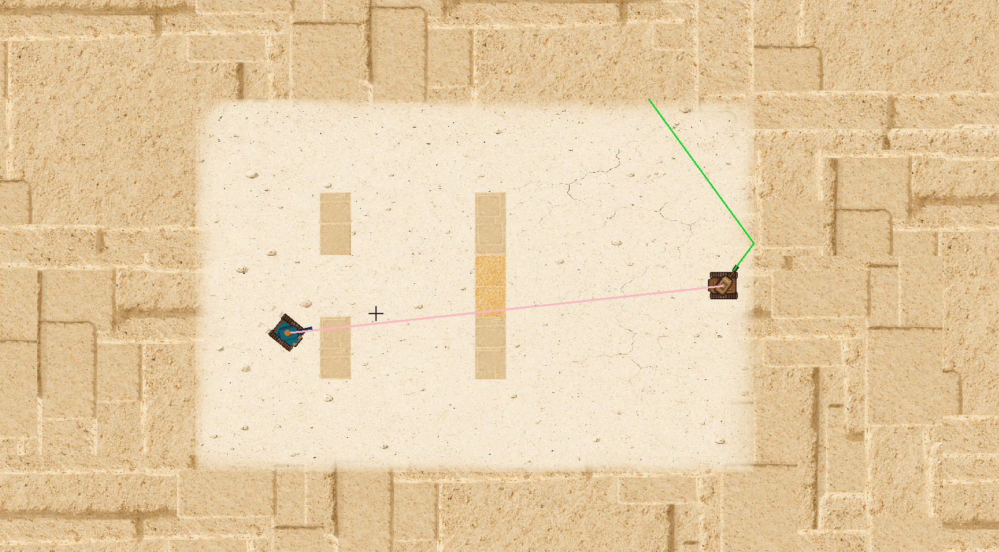
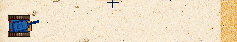
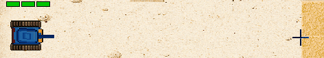
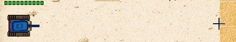
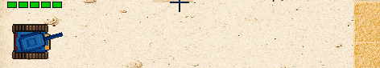
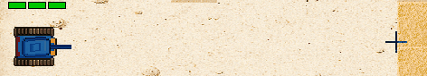
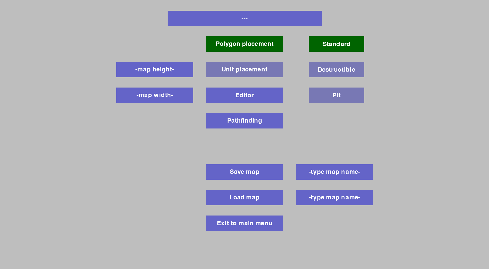

# Tank Game

**Tank Game** is inspired by the classic Wii Tanks game, offering enhanced mechanics and expanded content.

## Features

- 🎯 **50 Levels**  
- 🤖 **19 Enemy Types**  
- 💥 **Ricochet Mechanics**  
- 🧠 **Smart AI Behavior**
  
The first 20 levels closely replicate the original Wii Tanks gameplay. The final 30 levels feature unique challenges and introduce **10 new enemy units**.

### Tank scanning for targets


### Dodging, predicting shots, and intercepting incoming projectiles


### Tanks use A* pathfinding based on nodes


## 5 loadouts to choose from:

### Classic (no ammo count - max active projectiles)

### Sniper

### Autocannon

### Bouncer

### Burst

---

## Installation

Follow the steps below to get **Tank Game** up and running on your machine:

### 1. Install (Only works with python 3.12)

```bash
git clone https://github.com/Frode-Henrol/Tank_game
cd Tank_game
pip install -r requirements.txt
python -m tankgame
```

## Included Scripts

- `python -m tankgame` – Runs the main game.
- `python tankgame/map_maker.py` – Tool for creating custom maps.

---

## Map Maker Guidelines

> ⚠️ The map maker is a basic tool and not foolproof. Please follow these guidelines to avoid issues: (not fixed yet)

- Draw **polygons clockwise** to ensure proper collision detection.
- Avoid polygons with **fewer than 3 points** — this will crash the game.

### Example usage of map maker


### Quick Map Testing

To quickly test a map:
1. Save the map without a name or name it `map_test1`.
2. Run `python -m tankgame`.
3. Navigate to **Settings** → **Debug** → **Test map**

---

Enjoy the game, and happy tanking!
