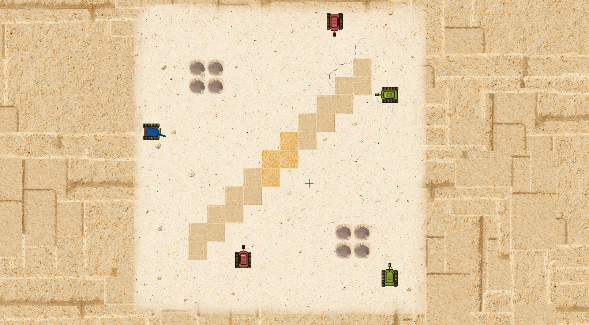
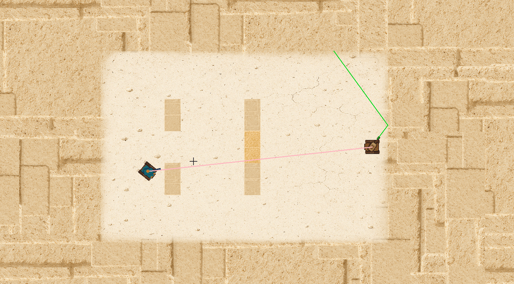
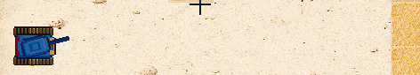
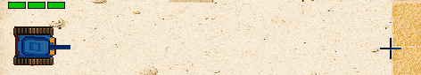
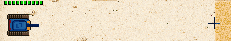
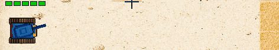
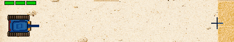
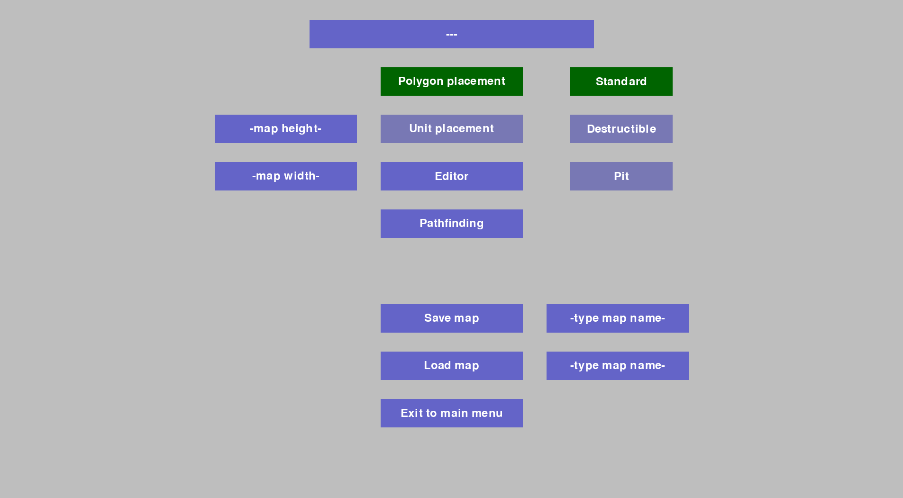
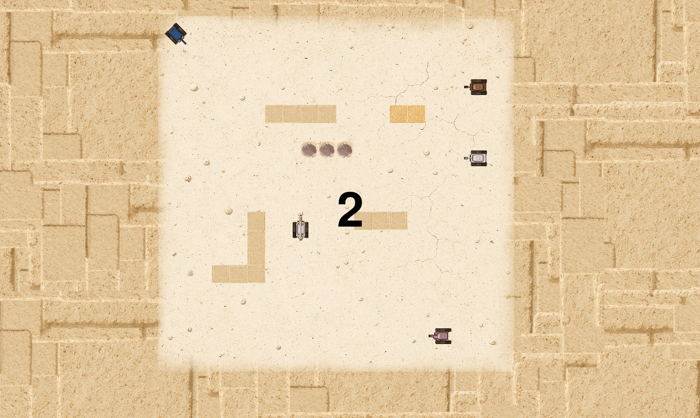

# Tank Game

**Tank Game** is inspired by the classic Wii Tanks game, offering enhanced mechanics and expanded content.


## Features

- 🎯 **50 Levels**  
- 🤖 **19 Enemy Types**  
- 💥 **Ricochet Mechanics**  
- 🧠 **Smart AI Behavior**
  
The first 20 levels closely replicate the original Wii Tanks gameplay. The final 30 levels feature unique challenges and introduce **10 new enemy units**.

### AI scanning for targets


### AI Dodging, predicting shots, and intercepting incoming projectiles


### AI uses A* pathfinding based on nodes


## 5 loadouts to choose from:

### Classic (no ammo count - max active projectiles)

### Sniper

### Autocannon

### Bouncer

### Burst

---

## Installation

Follow the steps below to get **Tank Game** up and running on your machine:

### 1. Install (Only works with python 3.12) Only tested on Windows!

```bash
git clone https://github.com/Frode-Henrol/Tank_game
cd Tank_game
pip install -r requirements.txt
python -m tankgame
```

## Included Scripts

- `python -m tankgame` – Runs the main game.
- `python tankgame/map_maker.py` – Tool for creating custom maps.

---

## Map Maker Guidelines

> ⚠️ The map maker is a basic tool and not foolproof. Please follow these guidelines to avoid issues: (not fixed yet).
> The map maker was only made to streamline the creation of the 50 ingame levels and not to be user friendly.

- Draw **polygons clockwise** to ensure proper collision detection.
- Avoid polygons with **fewer than 3 points** — this will crash the game.

### Example usage of map maker (use R to revert a placed object)


### The final map


### Quick Map Testing

To quickly test a map:
1. Save the map without a name or name it `map_test1`.
2. Run `python -m tankgame`.
3. Navigate to **Settings** → **Debug** → **Test map**

---

## Building a Standalone .exe (Windows)

The repo includes `tankgame.spec`, a PyInstaller recipe that bundles the game, its compiled `line_intersection` extension, and all asset folders (`map_files`, `misc_images`, `sound_effects`, `units`) into one `.exe`.

### One-time setup

Build from an isolated virtual environment, not your regular Python install — a global environment with unrelated packages (e.g. data-science/GUI libraries) can make PyInstaller pull in conflicting dependencies and fail.

```bash
python -m venv .venv_build
.venv_build\Scripts\activate
pip install -r requirements.txt
pip install pyinstaller
```

### Build

```bash
.venv_build\Scripts\activate
pyinstaller tankgame.spec --noconfirm
```

The finished executable is written to `dist/TankGame.exe`. `build/`, `dist/`, and `.venv_build/` are git-ignored, so nothing from the build ends up committed.

---

Enjoy the game, and happy tanking!
